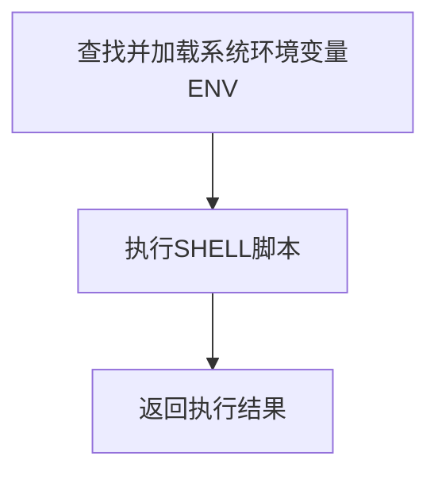
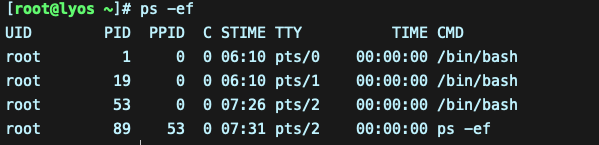
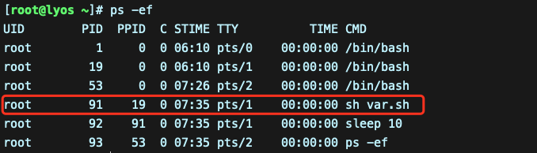

*前言：该笔记基于docker centos容器进行编程*

------

## 一 、Shell基础知识

### 1、查看环境和注释

#### 1.1 方法1


#### 1.2 方法2


#### 1.3 修改脚本注释样式

1.3.1 在shell中使用`#`来作为注释

1.3.2 默认的shell脚本注释颜色为深蓝色，基本看不到注释，所以可以按照下面的办法进行修改

1.3.3 找到vim的配置文件，  /etc/vimrc，用vim打开它  vim /etc/vimrc  然后按大写  G 到最后一行，插入 hi comment ctermfg=6 然后wq保存离开即可

1.3.4 颜色枚举值

> 默认的注释颜色是4  然后有0，1，2，3，4，5，6，7来选择。可以除了4和0以外选择其他的试试哦
>
> 0 黑色  ---默认VIM的背景就是黑色，所有如果你选择0，那么就看不到注释了
>
> 1  红色
>
> 2 墨绿
>
> 3 黄色
>
> 4 难看刺眼的颜色，即默认的颜色
>
> 5 类似粉色的，我不知道这种颜色叫什么
>
> 6 淡蓝色
>
> 7 白色 ---不要选择7，输入不刺眼

1.3.4 选择6的注释颜色样式


### 2、shell脚本创建

#### 2.1 脚本开头

> 一个规范的shell会在脚本开头第一行指出使用哪个解释器来执行脚本，一般在linux bash中是这样的

```shell
#!/bin/bash
```

- `#!`字符叫幻数（叫法无所谓），主要作用：在执行bash脚本，内核会根据 `#!`后的解释器来确定用哪个解释器来执行脚本内容

- 这一行必须是脚本顶端第一行，如果不是就是脚本的注释

  ```shell	
  #!/bin/bash  表示脚本开头指定解释器
  # Author: lyzin
  #   Date: 2021-06-07
  #!/bin/bash 表示注释
  ```

### 3、shell脚本执行

#### 3.1 执行顺序

3.1.1 运行脚本时会先这样



3.1.2 查找并加载系统环境变量ENV

- 用户登录Linux系统后Shell会随着登录而启动Shell，也就是直接登录到linux系统中，此时加载环境变量

  - 先加载  `/etc/profile`  : 全局环境变量文件

    - 然后执行  `/etc/profile.d` 目录下的脚本文件，这个目录也可以当做脚本的起始目录，用户登录以后自动执行这些脚本
    - 最后执行 `$HOME/.bash_profile`: 用户环境变量文件
      - 在这个文件中再去找 `$HOME/.bashrc `: 也叫用户环境变量文件，该文件有执行，没有则不执行
      - 接着在 `$HOME/.bashrc` 中找 `/etc/bashrc` （全局环境变量文件），如果有该文件，执行，没有则不执行
    - `$HOME`表示当前用户的家目录，可以用下面命令进行查看

    ```bash
    echo $HOME
    # 输出
    /root
    ```

- 用户的shell不是登录启动的，而是通过ssh等方式连接的

  - 只会执行 `$HOME/.bashrc `: 也叫用户环境变量文件，该文件有执行，没有则不执行
  - 接着在 `$HOME/.bashrc` 中找 `/etc/bashrc` （全局环境变量文件），如果有该文件，执行，没有则不执行
  - 如果想再非登录方式加载一个变量，就需要将变量写到 `$HOME/.bashrc` 或`/etc/bashrc`中，而不是写到 `$HOME/.bash_profile`或`/etc/profile`  

3.1.3 执行SHELL脚本

- shell脚本是从上至下，从左至右依次执行每一行的命令和语句
- 执行完一个命令再执行下一个，如有子脚本，先执行子脚本再执行主脚本

3.1.4 返回执行结果 

- 执行shell脚本时，会开启一个新的进程执行shell脚本，并将执行的结果返回

- 举例，如下脚本，脚本中设置了休眠10s，在脚本开始运行后，开启了一个新的子进程，休眠10s后，进程结束

  ```shell
  #!/bin/bash
  # Author: lyzin
  #   Date: 2021-06-07
  echo "haha"
  sleep 10
  ```

- 运行前查看系统进程列表

  

- 运行后查看系统进程列表，可以看到新开了一个子进程执行脚本内容，至于为什么sleep 10也开了一个子进程执行，后面再解释

  


#### 3.2 执行方式

> 目前常见的有三种方式执行shell脚本

3.2.1 方法1

- <font color='green'>推荐这种方法</font>

- 命令：`bash  scriptfile`或`sh  scriptfile`	
  - 当前脚本没有执行权限，也就是文件权限的x位为 `-`号

3.2.2 方法2

- 命令：`path/scriptfile`或`./scriptfile`
- 在当前路径下执行脚本，但是脚本必须要有执行权限，也就是文件权限的x位为`x`号
- 设置权限：`chmod  +x  scriptfile`

3.2.3 方法3

- 命令：`source scriptfile`或`. scriptfile`
- 这个命令主要是用来读取或加载指定的shell脚本文件，然后一次执行shell脚本文件中的内容
- 这些语句是在当前父shell脚本进程中执行，所以可以吧shell脚本的变量名或函数传给当前父进程使用	


## 二、Shell变量

### 1、变量


## 三、Shell变量数值计算

### 1、算术运算