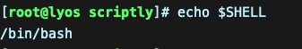
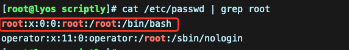
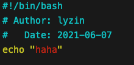
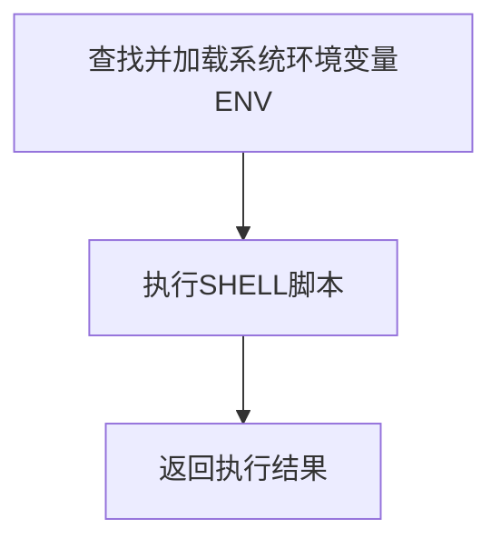

*前言：该笔记基于docker centos容器进行编程*

------

## 一 、Shell基础知识

### 1、查看环境和注释

#### 1.1 方法1



#### 1.2 方法2



#### 1.3 修改脚本注释样式

1.3.1 在shell中使用`#`来作为注释

1.3.2 默认的shell脚本注释颜色为深蓝色，基本看不到注释，所以可以按照下面的办法进行修改

1.3.3 找到vim的配置文件，  /etc/vimrc，用vim打开它  vim /etc/vimrc  然后按大写  G 到最后一行，插入 hi comment ctermfg=6 然后wq保存离开即可

1.3.4 颜色枚举值

> 默认的注释颜色是4  然后有0，1，2，3，4，5，6，7来选择。可以除了4和0以外选择其他的试试哦
>
> 0 黑色  ---默认VIM的背景就是黑色，所有如果你选择0，那么就看不到注释了
>
> 1  红色
>
> 2 墨绿
>
> 3 黄色
>
> 4 难看刺眼的颜色，即默认的颜色
>
> 5 类似粉色的，我不知道这种颜色叫什么
>
> 6 淡蓝色
>
> 7 白色 ---不要选择7，输入不刺眼

1.3.4 选择6的注释颜色样式




### 2、shell脚本创建

#### 2.1 脚本开头

> 一个规范的shell会在脚本开头第一行指出使用哪个解释器来执行脚本，一般在linux bash中是这样的

```shell
#!/bin/bash
```

- `#!`字符叫幻数（叫法无所谓），主要作用：在执行bash脚本，内核会根据 `#!`后的解释器来确定用哪个解释器来执行脚本内容

- 这一行必须是脚本顶端第一行，如果不是就是脚本的注释

  ```shell	
  #!/bin/bash  表示脚本开头指定解释器
  # Author: lyzin
  #   Date: 2021-06-07
  #!/bin/bash 表示注释
  ```

### 3、shell脚本执行

#### 3.1 执行顺序

3.1.1 运行脚本时会先这样



3.1.2 查找并加载系统环境变量ENV

- 

3.1.3 执行SHELL脚本

- shell脚本是从上至下，从左至右依次执行每一行的命令和语句
- 执行完一个命令再执行下一个，如有子脚本，先执行子脚本再执行主脚本

3.1.4 返回执行结果 

- 执行shell脚本时，会开启一个新的进程执行shell脚本，并将执行的结果返回

#### 3.2 执行方式

> 目前有三种方式执行shell脚本

3.2.1 方法1

- 

