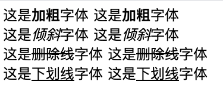

### 一、HTML介绍

#### 1、HTML头部解释

```html
<!Document html>: 文档类型声明标签，高速浏览器采用html5版本来显示页面
<html lang='en'>: 告诉浏览器是一个英文网站
<meta charset='UTF-8'>: 必须写，采用UTF-8保存文字，如果不写就会乱码
```

#### 2、标题标签

```HTML
// 每个标题标签都会独占一行
<h1></h1>
<h2></h2>
<h3></h3>
<h4></h4>
<h5></h5>
<h6></h6>
```

#### 3、段落标签和换行标签

```html
// 每个段落标签都会独占一行
<p>段落标签</p>

// 换行标签是单标签，break的缩写，强制换行，相当于回车换行
<br />

// 换行标签只是单独开始新的一行，跟段落不一样，段落会插入一些垂直的间距
```

#### 4、文本格式化标签

```html
<body>
    这是<strong>加粗</strong>字体
    这是<b>加粗</b>字体
    <br>

    这是<em>倾斜</em>字体
    这是<i>倾斜</i>字体
    <br>

    这是<del>删除线</del>字体
    这是<s>删除线</s>字体
    <br>

    这是<ins>下划线</ins>字体
    这是<u>下划线</u>字体
    <br>
</body>
```

- 下面是展示的样式

  

> 重点使用的是加粗和倾斜

#### 5、div和span

```html	
// span 和 div 都没有语义，就是一个盒子，用来装内容
<div>div块</div>
<span>span块</span>

// div是division的缩写，表示分割、分区，独占一行
// span表示跨度、跨距不会独占一行，是放个小盒子
```

#### 6、图像标签

> `img`标签，可以用来定义HTML中的图像，是一个单标签，
>
> 格式：``
>
> 单词`image`的缩写，意味图像
>
> `src`是`img`标签的必须属性，用来指定图像的路径和文件名

> <font style='color:green'>alt: 图片显示不出来，用文字显示</font>
>
> 格式：``

> <font style='color:green'>title: 鼠标放到图像上，提示文字</font>
>
> 格式：``

> <font style='color: green'>width: 给图像设置宽度，不需要写px像素单位</font>
>
> 格式：``

> <font style='color: green'>height: 给图像设置高度，不需要写px像素单位</font>
>
> 格式：``

> <font style='color: green'>border: 给图像设置边框，不需要写px像素单位</font>
>
> 格式：``

- 图像的样式后面由css来设置，很少用行内样式设置图像的样式

#### 7、超链接标签


### 二、CSS学习

