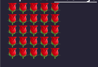
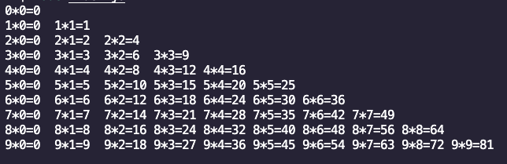
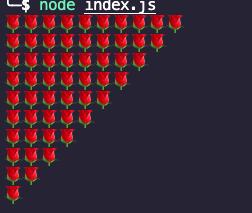

### 一、JS介绍

#### 1、js概念

> javascript是脚本语言，浏览器会有一个js解释器，对js代码逐行进行解释后执行

#### 2、js组成

> js由三部分组成，如下三部分
>
> - ECMAScript： javascript语法，规定了js的编程语法和基础核心知识，是所有浏览器需要保持的一个标准
> - DOM：页面文档对象模型
> - BOM：浏览器对象模型，控制浏览器的行为，弹出弹窗、打开页面等等、

#### 3、js的位置

- 有三种写法，详细看代码，分为行内、内嵌、外部js

- 注意：外部js的两个`script`标签之间不可以写内容

  ```html
  <!DOCTYPE html>
  <html lang="en">
  <head>
      <meta charset="UTF-8">
      <meta name="viewport" content="width=device-width, initial-scale=1.0">
      <title>day2</title>
      <script>
          // 内嵌式js
          alert('内嵌式js')
      </script>
  </head>
  <body>
      <!-- 行内式js -->
      <input type="button" value="点我" onclick="alert('点我了')">
  </body>
  <!-- 外链式 -->
  <script src="index.js"></script>
  </html>
  ```

#### 4、js注释

```html
单行注释:  
// 单行注释

多行注释: 
/* 多行注释*/
```

#### 5、js输入输出

> alert('msg'):  浏览器的弹出框
>
> console.log('msg'): 控制台打印输出
>
> prompt('msg'): 浏览器提示输入


### 二、数据类型

#### 1、变量

- 声明变量：  `var  age;`

- `var`是`js`的一个关键字，用来声明变量（`variable`变量的意思），使用这个关键字，会自动分配内存空间

- 变量初始化：先声明再赋值

```js
var  age;
age = 18;
console.log(age) // 18
```

- 变量只声明不赋值：返回结果是`undefined`，表示没有给值，是未定义的变量

```js
var  age;
console.log(age) // undefined
```

- 变量不声明不赋值直接使用会报错

```js
console.log(tr); // 提示 tr没有被定义的报错
```

- 变量直接赋值使用不声明，可以使用，不过不推荐该方法，应该要用关键字`var`来声明变量

```js
qq = 123;
console.log(qq);
```

- 更新变量

```js
var  age;
age = 18;
age = 20;
console.log(age) // 20
```

- 变量交换值

```js
var tmp; // 临时变量
var num1 = 10;
var num2 = 20;

// 1.将tmp等于num1的值
tmp = num1;
// 2.将num1等于num2的值
num1 = num2
// 3.将num2等于tmp的值
num2 = tmp

// 输出num1、num2
console.log(num1); // 20
console.log(num2); // 10
```

#### 2、数据类型

> js的数据类型是在程序运行时自动判断的，也就是自动推导数据类型
>
> js数据类型分类：
>
> - 简单数据类型：`Number`、`String`、`Boolean`、`Null`、`Undefined`
> - 复杂数据类型：`Object`

##### 2.1 数值型number

> 包含整型和浮点型，默认值是`0`

```js
var num = 10;
console.log(num); // 10

// 数字型最大值
console.log(Number.MAX_VALUE);

// 数字型最小值
console.log(Number.MIN_VALUE);
```

```js
// 下面内容作为了解
alert(Infinity);  // 无穷大
alert(-Infinity);  // 无穷小
alert(NaN);  // 非数字，Not a Number
```

```js
// isNaN(variable) 这个方法用来判断非数字，并且返回一个值，如果是数字，返回false，不是数字，返回的是true
console.log(isNaN(123)) // 输出false
console.log(isNaN('test nova')); // 输出true
```


##### 2.2 布尔类型boolean

> 布尔类型，结果为`true`、`false`对应数字`1`和`0`，可以用来加法运算

```js
// true  表示真
var flag_t = true;
console.log(flag_t); // true

// false 表示假
var flag_f = false;
console.log(flag_f); // false

// 布尔类型参与运算，true = 1，false = 0
console.log(true + 1); // 输出 2
console.log(false + 1); // 输出 1
```


##### 2.3 字符串型String

> 字符串类型，需要带引号
>
> `\n` 表示换行

```js
var str = '这是一个字符串\n变量'
console.log(str); // 输出: 这是一个字符串变量
```

```js
// 字符串的长度
var str = '我是谁';
console.log(str.length); // 3
```

```js
// 字符串的拼接
var str1 = 'harry';
var str2 = 'potter'
var str3 = str1 + str2;
console.log(str3); // 输出：harrypotter

// 字符串的拼接，只要有字符串和其他类型拼接，都会展示为字符串类型
console.log(12 + 'jim'); // 输出: 12jim
```


##### 2.4 undefined

> `var age;`只声明变量不赋值，就是未定义类型，此时`age`的值是`undefined`

```js
var age;
console.log(age); // 输出: undefined

console.log(age + 'ko'); // 输出: undefinedko

// undefined和数字相加，不是一个数字
console.log(age + 1); // 输出 NaN
```


##### 2.5 null类型

> `var age=null;`声明变量是一个空值，默认值是`null`

```js
var age = null;
console.log(age); // 输出: null

console.log(age + 'ko'); // 输出: nullko

// null和数字相加，输出数字，空值表示完全是空的
console.log(age + 1); // 输出 1
```


##### 2.6 检测数据类型

```js
var age = 10;
console.log(typeof age); // 输出: number

var age_1 = 'this is js';
console.log(typeof age_1); // 输出: string

var age_2 = true;
console.log(typeof age_2); // 输出: Boolean

var age_3;
console.log(typeof age_3); // 输出: undefined

var age_4 = null;
console.log(typeof age_4); // 输出: object (后面再学对象时有用)
```

#### 3、数据类型转换

##### 3.1 转换为字符型

> `age.toString()` 不常用
>
> `String(age)`不常用
>
>  `+`号拼接,数字加一个空字符串，就可以变为字符串类型（<font style="color: red">常用</font>）

```js 
// toString() 不常用
var age = 18;
console.log(age.toString());  // 18
console.log(typeof age.toString());  // string

// String() 不常用
var age_1 = 18;
console.log(String(age_1));  // 18
console.log(typeof age_1.toString());  // string

// +号拼接,数字加一个空字符串，就可以变为字符串类型
var age_2 = 18
var age_3 = age + '';
console.log(age_3);  // 18
console.log(typeof age_3);  // string
```

##### 3.2 转换为数字

- `parseInt(string)` 转换为整数型

```js
// parseInt(string) 转换为整数型，得到的是一个整数
var sex = '123';
var sex_int= parseInt(sex);
console.log(sex_int);  // 123
console.log(typeof sex_int); // number

// parseInt(string) 只会取整数部分，不会走四舍五入
var sex_1 = '3.14'
var sex_2 = '3.94'
console.log(parseInt(sex_1)); // 3
console.log(parseInt(sex_2)); // 3

// parseInt(string) 可以用来取像素整数，只会取到数字部分，但是开头是非数字的取时会显示为非数字，结果为NaN
var sex_3 = '314px'
var sex_4 = 'rem314px'
console.log(parseInt(sex_3)); // 314
console.log(parseInt(sex_4)); // NaN
```

- `parseFloat(string)`转换为浮点型

```js
// parseFloat(string) 转换为浮点型，得到的是一个整数
var sex = '123';
var sex_int= parseFloat(sex);
console.log(sex_int);  // 123
console.log(typeof sex_int); // number

// parseFloat(string) 转换为浮点型，不会走四舍五入
var sex_1 = '3.14'
var sex_2 = '3.94'
console.log(parseFloat(sex_1)); // 3.14
console.log(parseFloat(sex_2)); // 3.94

// parseFloat(string) 可以用来取像素整数，只会取到数字部分，但是开头是非数字的取时会显示为非数字，结果为NaN
var sex_3 = '314.34px'
var sex_4 = 'rem314.34px'
console.log(parseFloat(sex_3)); // 314.34
console.log(parseFloat(sex_4)); // NaN
```

- 隐式转换为数字，支持 `-`、`*`、`/`

```js
var age = '12';
var age_int = age - 0;
console.log(age_int); // 12
console.log(typeof age_int); // number 
```

##### 3.3 转换为布尔类型

```js
console.log(Boolean('')); // false
console.log(Boolean(0)); // false
console.log(Boolean(null)); // false
console.log(Boolean(undefined)); // false
console.log(Boolean(NaN)); // false
console.log(Boolean('this is js')); // true
console.log(Boolean(13)); // true
```


#### 4、运算符

##### 4.1 算术运算符

> 就是`加`、`减`、`乘`、`除`、`取余`、`浮点数`

```js
// 加
console.log(1 + 1); // 2
// 减
console.log(1 - 1); // 0
// 乘
console.log(1 * 1); // 1
// 除
console.log(1 / 1); // 1
// 取余
console.log(1 % 1); // 0  
// 浮点数相加会有精度问题，不建议浮点数直接相加
console.log(0.1 + 0.2); // 0.30000000000000004
```

##### 4.2 表达式和返回值

```js
// 1+1 是表达式，1+1 的结果是2 2是返回值
var sum = 1 + 1;
console.log(sum); // 2
```

##### 4.3 前置递增运算符

> 格式： `++num`
>
> 定义： 让一个变量自己`+1`
>
> 概念：`++num`在运算时，先加`1`，再返回值

```js
// 原始变量自己+1
var num = 1;
num = num + 1;
console.log(num); // 2

// 上述变法比较麻烦，可以用 ++num(前置递增运算符)
// ++num 等同于 num = num +1
var num_2 = 2;
++num_2
console.log(num_2);  // 3

// ++num在运算时，先加1，再返回值
var num_3 = 3;

// 下面结果是5，因为++num_3 + 1 运算时是先进行了+1，此时
// ++num_3 的值是4，4再+1就是5
console.log(++num_3 + 1);  // 5
console.log(num_3); // 4
```

##### 4.3 后置递增运算符(<font style='color:red'>常用</font>)

> 格式： `num++`
>
> 定义： 让一个变量自己`+1`
>
> 概念：`num++`在运算时，先返回`num`原值，再`+1`
>
> 需要注意: 当 `num++ `单独使用时，返回值和`num++`效果一样，不单独使用时，num++`返回的是`num`这个变量的原值

```js
var num = 10;

// 当num++单独使用时,效果和++num一样,所以下面这个表达式的结果是10+1=11,此时num=11
num++;
console.log(num); // 11

// 下面用num++ + 2时，num++先返回原值，此时num的原值就是11，所以下面的表达式结果就是11+2=13
console.log(num++ + 2); // 13
```

#####  4.4 比较运算符

> 大于： `>`
>
> 小于： `>`
>
> 大于等于： `>=`
>
> 小于等于： `<=`
>
> 等于2个等于号： `==` ，默认会进行数据类型转换，会把字符串类型转换为数字型
>
> 不等于： `!=`
>
> 全等：`===`，两个比较的值和数据类型一样，才是true

```js
// 大于 >
console.log(3 > 4); //false  

// 小于 >
console.log(3 < 4); // true

// 大于等于 >=
console.log(3 >= 4); //false  

// 小于等于 <=
console.log(3 <= 4); //true

// 等于2个等于号 == ，默认会进行数据类型转换，会把字符串类型转换为数字型，属于隐式转换
console.log(3 == 5); //false 
console.log('sum' == 'bob'); //false 
console.log(13 == 13); //true
console.log(13 == '13'); //true
console.log(13 == '13px'); // false
console.log(13 == 'rem13px'); // false

// 不等于 !=
console.log(3 != 5); // true 
console.log('sum' != 'bob'); // true 
console.log(13 != 13); // false
console.log(13 != '13'); // false
console.log(13 != '13px'); // true
console.log(13 != 'rem13px'); // true

// 全等 ===
console.log(3 === 5); //false 
console.log('sum' === 'bob'); //false 
console.log(13 === 13); // true 
console.log(13 === '13'); //false 
```

##### 4.5 逻辑运算符

> 逻辑与：代码符号`&&`，表示and的意思
>
> 逻辑或：代码符号`||`，表示or的意思
>
> 逻辑非：代码符号`!`，表示not的意思

```js
// 逻辑与：代码符号 && ，表示and的意思，两侧都为true，结果才是true，只要有一侧为false，结果为false
console.log( 3 < 5 && 4 > 5); // false
console.log( 3 < 5 && 4 < 5); // true

// 逻辑或：代码符号 ||，表示or的意思，两侧都为false，结果才是false，只要有一侧为true，结果为true
console.log( 3 < 5 || 4 > 5); // false
console.log( 3 < 5 || 4 < 5); // true

// 逻辑非：代码符号 ！，表示not的意思，表示非的意思，会将true的变为false，然后把false变为true
console.log( !(4 > 5) ); // true  4大于5 是false，然后逻辑非加上，就变成了true
console.log( !(4 < 5) ); // false 4小于5 是true，然后逻辑非加上，就变成了false
```

- 逻辑与运算符号的中断/短路逻辑

> 原理：当有多个表达值时，左边的表达式值可以确定结果时，就不需要计算右边的表达式

```js
// 因为是中断，所以逻辑运算符后面的不再进行计算
// 如果表达式1为真，则返回表达式2   如果表达式1为假，则返回表达式1
console.log(123 && 456); // 456
console.log(0 && 456); // 0在js中表示false
console.log(0 && 1 + 2 && 456 + 789); // 0在js中表示false
```

- 逻辑或运算符号的中断/短路逻辑

> 原理：当有多个表达值时，左边的表达式值可以确定结果时，则返回左边的表达式

```js
// 因为是中断，所以逻辑运算符后面的不再进行计算
// 如果表达式1为真，则返回表达式1   如果表达式1为假，则返回表达式2
console.log(123 || 456); // 123
console.log(0 || 456); // 456
console.log(0 || 1 + 2 || 456 + 789); // 3，因为0是false，所以此时返回1+2的结果3，但是3是true，所以和（456+789）或的时候返回3

var num = 0;
console.log(123 || num++);
console.log(num); // 0 因为上面的逻辑或运算，由于123是true，所以返回了123，后面的num++不会运行，所以num的值仍是0
```

##### 4.6 赋值运算符

> 直接赋值：`=`
>
> 加减一个数后再赋值：`+=`、`-=`
>
> 乘除取模后再赋值：`*=`、`/=`、`%=`

```js
// 赋值运算符
var num = 1;

// num++ 和 += 的区别
// num++ 只能每次加+1
//  += 可以每次加N
// -= 、*= 、 /= 、 %= 同理
var num_t = 3;
num_t += 3 // 每次可以+3，等同于  num_t = num_t + 3  , num_t = 6
console.log(num_t); // 6
```

##### 4.7 运算符优先级

> 优先级  运算符解释  符号
>
> 1  小括号：`()` 
>
> 2  一元运算符 `++` `--` `!`
>
> 3  算数运算符 先`*`   `/`    `%`后 `+` `-`
>
> 4  比较运算符  `>` `>=` `<=`
>
> 5  相等运算符  `==` `!=` `===` `!==`
>
> 6  逻辑运算符 条件表示式有`&&`和`||`先计算`&&` 再计算`||`
>
> 7  赋值运算符 `=`
>
> 8 逗号运算符 `,`	   

### 三、流程控制

> 分支流程控制和其他编程语言相同，不做过多介绍，只记录语法

#### 1、if-else分支

```js
// if 格式，条件表达式为true，执行if判断里的语句代码，条件表达式为false，则执行else代码
// if (条件表达式) {
//   statement;    
// } else {
//   statement
// }

if (3 > 1) {
    console.log('3 > 1');
} else {
  	console.log('3 < 1');
}

// output  : '3 > 1'
```

- 案例：判断闰年

```js
var year = 2013;

if (year % 4 == 0 && year % 100 != 0 || year % 400 == 0) {
    console.log(year + '年是闰年');
} else {
    console.log(year + '年不是闰年');
} 

// output
// 2013年不是闰年
```

#### 2、if-else if -else 语句

> 这个是多条件语句
>
> `else if`是需要跟一个条件表达式的

```js
var year = 88;

if (year > 90) {
    console.log('90 score');
} else if (year > 80) {
    console.log('80 score');
} else {
    console.log('小于80score');
}
// output
// 80 score
```

#### 3、三元表达式

> 用来做一些简单的`if-else`判断
>
> 格式： 条件表示式 ? 表达式1 : 表达式2
>
> 解释：条件表达式为真，则返回表达式1的值，如果条件表达式为假，则返回表达式2的值

```js
var sum = 10;

var ret = sum > 6 ? '大于6' : '小于6';

console.log(ret);

// output
// 大于6

// 数字补0,大于10不用补0.小于10需要补0
var num = '9';
var ret = num < 10 ? '0' + num : num;

console.log(ret);  // 09
console.log(typeof ret); // string
```

#### 4、switch语句

> 解释：多个值来匹配`case`
>
> 语法格式：
>
> ```js
> switch (表达式) {
>   case va1ue1:
>     statement;
>     break;
>   case va1ue2:
>     statement;
>     break;
>   ...
>   default:
>   	statement;
>     break;
> }
> ```
>
> `switch`语法注意事项：
>
> - `switch`语句里的表达式是一个准确的值，经常是一个变量
> - 与`case`后面的值匹配时是全等匹配，既需要判断值是否相等，还要看数据类型是否相等

```js
var num = 9;

switch (num) {
    case 1:
        console.log('>>1');
        break;
    case 2:
        console.log('>>2');
        break;
    case 9:
        console.log('>>9');
        break;
    default:
        console.log('not found!');
        break;
}
```

- `switch`和`if - else`的区别
  - `switch`语句处理`case`比较确定的情况，`if else `更灵活，用于处理判断(大于、小于等判断条件)
  - `switch`语句进行条件判断后直接执行程序的语句，效率高，`if else`语句条件的判断条件比较多，需要不断进行匹配
  - `switch`语句适用于分支比较多的情况，`if-else`适用于分支较少的情况

#### 5、循环语句

##### 5.1 for 循环

> `for`循环语句格式
>
> for循环的里条件表达式条件走完以后，就会退出循环

```js
for (var i = 0; i <= 10; i++){
    console.log('i = ' + i);
}
// ouput:
// i = 0
// i = 1
// i = 2
// i = 3
// i = 4
// i = 5
// i = 6
// i = 7
// i = 8
// i = 9
// i = 10

// for循环里使用if判断
for (var i = 0; i <= 10; i++){
    if (i > 9){
        console.log('i = ' + i);
    }
}
// output
// i = 10
```

- 求1...100的整数和

```js
var sum = 0;
for (var i = 0; i <= 100; i++){
     sum += i; // 等价于sum = sum + i; 
}
console.log(sum); // 5050
```

- 求1...100的所有数的平均值

```js
var sum = 0;
for (var i = 0; i <= 100; i++){
     sum += i; // 等价于sum = sum + i; 
}

var avg = sum / 100;
console.log(avg); // 50.5
```

- 求1..100的奇数和偶数的和

```js
// odd是奇数，even是偶数
var odd = 0;
var even = 0;
for (var i = 0; i <= 100; i++){
    if (i % 2 == 0) {
        even += i;
    } else {
        odd += i;
    }
}

var sum = odd + even;
console.log(sum); // 5050
```

- 求1...100的能被3整除的数字之和

```js
// odd是奇数，even是偶数
var enu = 0;
for (var i = 0; i <= 100; i++){
    if (i % 3 == 0) {
        enu += i;
    }
}
console.log(enu); // 1683
```

- for循环求学生成绩总数和平均成绩

```js
// for循环求学生成绩总数和平均成绩
var stu_num = prompt('输入学生个数:');
var stu_sum_scores = 0;
for (var i = 1; i <= stu_num; i++){
    var stu_score = prompt('请输入第' + i + '个学生成绩');
    stu_sum_scores += parseFloat(stu_score);
}
var stu_score_avg = stu_sum_scores / stu_num;
console.log('学生总成绩:' + stu_sum_scores); 
console.log('学生的平均成绩:' + stu_score_avg); 
```

- 画星星

```js
// 小星星的个数
var stu_num = 5
var star_fmt = ''; 
for (var i = 1; i <= stu_num; i++){
    star_fmt += '⭐️';
}
console.log(star_fmt);

// ouput:
// ⭐️⭐️⭐️⭐️⭐️
```

##### 5.2 for嵌套循环

> - 语法格式：
>
> ```js
> for (外层初始化变量; 外层的条件表达式; 外层的操作表达式) {
>    for (里层初始化变量; 里层的条件表达式; 里层的操作表达式) {
>             statement;
>     }
> }	
> ```
>
> - 循环嵌套：
>   - 外层循环执行一次，里层循环全部执行一次

```js
for (var i = 0; i <= 4; i++){
    console.log('这是外层的第' + i + '次');
    for (var j = 0; j <= i; j++){
        console.log('这是里层的第' + j + '次');
    }
    console.log();
}

// 输出:
// 这是外层的第0次
// 这是里层的第0次

// 这是外层的第1次
// 这是里层的第0次
// 这是里层的第1次

// 这是外层的第2次
// 这是里层的第0次
// 这是里层的第1次
// 这是里层的第2次

// 这是外层的第3次
// 这是里层的第0次
// 这是里层的第1次
// 这是里层的第2次
// 这是里层的第3次

// 这是外层的第4次
// 这是里层的第0次
// 这是里层的第1次
// 这是里层的第2次
// 这是里层的第3次
// 这是里层的第4次
```

- 打印五行五列玫瑰花

> 需要定义一个空字符串变量来接收输出的玫瑰花
>
> 这个五行五列可以写活了，使用变量代替接收需要打印多少行多少列

```js
var exper = '';
for (var i = 1; i <= 5; i++){ // 最外层循环控制打印5行
    for (var j = 1; j <= 5; j++){ // 最里层循环控制每行打印5个
        exper += '🌹';  // 使用空字符串将每次循环打印的玫瑰花连接起来
    }
    // 最里层循环结束以后，表示一行打印结束，所以需要给 exper这个字符串加一个换行符，表示重新在新的一行展示新一行玫瑰花，注意这里的换行不能用console.log('\n')替换，会出现所有玫瑰花全在一行的情况，因为console.log('\n')只是将当前循环结束后添加了一个空白内容的换行了，最后会看到有很多空白的换行，但是exper这个表达式自身的没有换行，所以需要将exper在每次循环结束都添加一次换行
    exper += '\n'; 
}

console.log(exper);
```



- 9X9乘法口诀

```js
var exper = '';
for (var i = 0; i <= 9; i++){
    for (var j = 0; j <= i; j++){
        var ret = i * j;
        var new_ret = ret < 10 ? ret + ' ' : ret; 
        var exper = exper + i + '*' + j + '=' + new_ret + ' ';
        if (i == j) {
            exper += '\n';
        }
    }
}
console.log(exper);

// 输出如下图		
```



- 打印倒三角

```js
var exper = '';
for (var i = 0; i <= 9; i++){
    for (var j = i; j <= 9; j++){
        exper += '🌹';
    }
    exper += '\n';
}
console.log(exper);

```



##### 5.3 while循环

> while 循环，条件表达式为true，则执行循环，否则退出循环
>
> 语法格式：
>
> ```js
> while (条件表达式) {
>     代码语句;
> }
> ```

```js
var num = 0;
while (num < 3) {
    console.log('内层while循环: num:' + num);
    num++;
}
```

##### 5.4 do while循环

> `do...while`是`while`循环的变体，执行循环前先自己执行一次代码，然后对`while`中的条件判断语句判断，如果为`true`，则继续执行`while`循环，如果为`false`，则退出循环
>
> 语法格式:
>
> ```js
> do {
>   statement;
> }while (条件表达式);
> ```
>
> `do...while`语句会至少执行一次循环代码，再进行`while`的条件判断循环

```js
var num = 3;

do {
    console.log(num);
    num--;
} while (num > 0);
```

##### 5.5 break关键字

> `break`用于退出循环

```js

for (var i = 0; i < 3; i++){
    if (i == 2){
        console.log('i == 3');
        break;
    }
}
```

##### 5.6 continue关键字

> `continue`跳出本次循环

```js
for (var i = 0; i < 3; i++){
    if (i % 2 === 0){
        continue;
    }
    console.log('i = ' + i);
}
```


### 四、数组

#### 1、数组创建

> - 两种方式：
>   - 利用`new`创建数组，学习面向对象再使用
>   - 利用数组字面量创建数组，字面量意思是看到符号就可以知道是什么意思，数组字面量是符号`[]`
> - 数组特点：
>   - 数组元素可以是任意类型，但是需要以`逗号`隔开

```js
// 创建了一个空数组
var arr = [];

// 创建了一个数组
var nameArr = ['sam', 'bob', 'john'];


```

#### 2、访问元素

> - 格式：
>
> ```js
> 数组名[索引值]
> ```
>
> - 索引值从`0`开始，访问超过索引值的元素，结果是`undefined`，因为数组元素不存在，访问就是undefined

```js
// 访问元素使用 nameArr[索引号]，索引号从0开始
var nameArr = ['sam', 'bob', 'john'];
console.log(nameArr);  // ['sam', 'bob', 'john']
console.log(nameArr[0]); // sam
console.log(nameArr[1]); // bob 
console.log(nameArr[2]); // john
console.log(nameArr[3]); // undefined
```

#### 3、遍历数组

> 使用`for`循环遍历数组
>
> 获取数组的长度：`Arr.length`

```js
// 创建了一个数组
var nameArr = ['sam', 'bob', 'john'];

// i < nameArr.length 不能设置等于，因为索引值从0开始，数组长度总比索引值大于1，所以不能写等于
for (var i = 0; i < nameArr.length; i++){
    console.log('元素值:' + nameArr[i]);
}
```

- 求数组的总和与平均值

```js
// 
var sum = null;
var numArr = [1, 2, 3, 4];

for (var i = 0; i < numArr.length; i++) {
    sum += numArr[i];
}
var avg = sum / numArr.length;
console.log('1到4的总和:' + sum); // 10
console.log('1到4的平均数:' + avg); // 2.5
```

- 求数组元素的最大值

```js
var numArr = [1, 2, 99, 35, 3, 4];

var max_num = numArr[0];

for (var i = 1; i < numArr.length; i++) {
    if (max_num < numArr[i]) {
        max_num = numArr[i];
    }
}

console.log(max_num); // 99
```

- 数组元素变为字符串用分隔符连接

```js
var numArr = [1, 2, 99, 35, 3, 4];
var strArr = '';
var sep = '|'; // 连接符，可以设置任何连接符
for (var i = 0; i < numArr.length; i++) {
    strArr += numArr[i] + sep;
}

console.log(strArr); // 1|2|99|35|3|4|
console.log(typeof strArr); // string
```

#### 4、数组新增元素

> - 可通过修改数组的length属性来进行数组扩容
>   - length属性是可以读写的，写的权限意思就是可以手动再进行赋值
> - 对数组继续使用索引赋值
>   - 数组元素的个数为3，想要新增元素，就可以从索引值4开始对数组进行新增赋值

##### 4.1 修改数组的length属性

```js
var numArr = [1, 2, 3, 4];
var numArr_len = numArr.length;

console.log(numArr_len); // numArr的长度是4

// 修改数组长度length属性值来进行修改
// 将numArr的长度从4变为5
// numArr的值是：[ 1, 2, 3, 4, <1 empty item> ]，可以看到长度变为5以后，最后一个元素为<1 empty item>，表示空的元素
// 然后取一下numArr的最后一个的值和类型都为：undefined
numArr.length = 5;
console.log(numArr); // [ 1, 2, 3, 4, <1 empty item> ]
console.log(numArr[4]); // undefined
console.log(typeof numArr[4]); // undefined

// 将numArr的长度从4变为4，numArr的元素不变
numArr.length = 4;
console.log(numArr); // [1, 2, 3, 4]

// 将numArr的长度从4变为3，numArr的原来元素个数会从4个变为3个，因为长度变小了，所以丢弃了最后一个元素
numArr.length = 3;
console.log(numArr); // [ 1, 2, 3 ]
```

##### 4.2 修改索引号赋值

```js
var naArr = ['red', 'green', 'blue'];
console.log(naArr); // [ 'red', 'green', 'blue' ]

// 新增元素，也叫追加元素，给索引值增加
naArr[3] = 'yellow';
console.log(naArr); // [ 'red', 'green', 'blue', 'yellow' ]
console.log(naArr[3]); // yellow

// 给已有的索引值进行追加
naArr[1] = 'pink';
console.log(naArr); //  [ 'red', 'pink', 'blue', 'yellow' ]
console.log(naArr[1]); // pink

// 不要给数组名直接赋值，数组会被直接替换掉
naArr = 'sun';
console.log(naArr); //sun
```

##### 4.3 筛选数组的元素

```js
// 筛选出大于等于3的元素
// arr.length这个属性是自动变化的，当数组没有元素时为0，数组又元素时会自动计算数量
var arr = [1,2,3,4,5];
var newArr = [];
for (var i=0; i < arr.length; i++) {
    if (arr[i] >= 3){
        newArr[newArr.length] = arr[i];
    }
}
console.log(newArr); // [ 3, 4, 5 ]
```

##### 4.4 反转数组元素

```js
// 数组翻转
// arr.length这个属性是自动变化的，当数组没有元素时为0，数组又元素时会自动计算数量
// 将旧数组索引号最后一个给新元素的第一个，然后一次类推
var arr = [1,2,3,4,5];
var newArr = [];
for (var i=arr.length - 1; i >= 0; i--) {
    newArr[newArr.length] = arr[i];
}
console.log(newArr); // [ 5, 4, 3, 2, 1 ]
```

### 五、函数

#### 1、函数格式

> 函数格式:
>
> ```js
> function  函数名() {
>     // 函数体
> }
> ```
>
> 函数是做某件事情
>
> 切记：<font style='color: green'>函数只声明不调用是不会被执行的</font>

```js
// 函数定义
function hello() {
    console.log('hi, func');
}

// 函数调用
hello(); // hi, func
```

- 函数求`1-100`的和

```js
// 函数定义
function hello() {
    var sum = 0;
    for (var i = 0; i <= 100; i++){
        sum += i;
    }
    console.log(sum);
}

// 函数调用
hello();
```

#### 2、函数的参数

> - 函数参数的形式
> - `js`中函数不传值，默认的参数值时`undefined`
>
> ```js
> function 函数名(形参1, 形参2...) {
>     函数体;
> }
> 
> 
> ```
>
> - 函数参数的调用时规则，可以看出js的函数很不严谨，会出现形参和实参个数不匹配的问题
>   - 调用函数传入的参数个数和函数定义时一致，正常输出
>   - 调用函数传入的参数个数大于函数定义时的参数个数，会把多余传入的丢弃掉
>   - 调用函数不传入的参数，函数里面的形参会变为`undefined`

```js
// 函数的参数
function hello(name) {
    console.log('Hi, ' + name);
}

// 带参数的函数调用
// 调用函数传入的参数个数和函数定义时一致，正常输出
hello('bob'); // Hi, bob

// 调用函数传入的参数个数大于函数定义时的参数个数，会把多余传入的丢弃掉
hello('sam', 'john'); // Hi, sam

// 调用函数不传入的参数，函数执行里面的形参会变为undefined
hello(); // Hi, undefined
```

- 函数的例子

```js
// 函数的参数
function hello(a, b) {
    var sum = a + b;
    console.log('sum = ' + sum);
}

hello(3,4); // sum = 7
```

#### 3、函数的返回值

> - `return`关键字是函数返回值
>
> - `return`可以接受三元运算符
> - `return`表示函数被终止，遇到`return`后面的代码不会再被执行
> - `return`只能返回一个值，有多个值以逗号隔开页只是以最后一个为准，不过我们可以把N个结果值包在一个数组里返回也可以
> - 如果函数没有`return`关键字，则返回`undefined`值

```js
// 函数的参数
function hello(a, b) {
    var z = a + b;
    return z;
}

var ret = hello(3,4);
console.log(ret); // 7
```

#### 4、可变长参数`arguments`

> 当我们不知道要传入的参数有多少个时，可以用`arguments`获取到
>
> 所有函数都有一个`arguments`属性，用来获取所有传入的参数，和`python`的`args`/`kwargs`作用一样
>
> - `arguments`是一个伪数组
> - 伪数组
>   - 不是真正的数组
>   - 有`length`属性
>   - 按索引的方式存储
>   - 但是没有数组的`push()` 、`pop()` 等方法

```js
// 函数的参数
function hello() {
    console.log(arguments); // [Arguments] { '0': 1, '1': 2, '2': 3 }
    console.log(arguments.length); // 3
    console.log(typeof arguments); // object
}

hello(1,2,3);
```

- 求任意个数的最大值

```js
function  getMax() {
    var maxVal = arguments[0];
    for (var i = 1; i < arguments.length; i++ ){
        if (maxVal < arguments[i]){
            maxVal = arguments[i];
        }
    }
    return maxVal;
}

var ret1 = getMax(1,2,3,4);
console.log(ret1); // 4

var ret2 = getMax(11,56,43,2);
console.log(ret2); //56

var ret3 = getMax(10,676,7,1);
console.log(ret3); // 6676
```

- 函数反转任意数组

```js
function reverse(arr) {
    var newArr = [];
    for (var i = arr.length - 1; i >= 0; i--){
        newArr[newArr.length] = arr[i];
    }
    return newArr;
}

var ret = reverse([1,2,3,4]);
console.log(ret); // [ 4, 3, 2, 1 ]
```

#### 5、函数相互调用

> 切记：<font style='color: green'>函数只声明不调用是不会被执行的</font>

```js
function foo(){
    console.log('foo func');
}

function boo(){
    foo();
    console.log('boo func');
}

boo(); 
// 输出: 
// foo func
// boo func
```

#### 6、函数声明方式

> - 方式一
>
>   - 利用函数关键字定义，也叫命名函数
>
>   - ```js
>     function  函数名() {
>         // 函数体
>     }
>     ```
>
> - 方式二
>
>   - 函数表达式（匿名函数）
>
>   - ```js
>     var  变量名 = function() {
>         // 函数体
>     }
>     ```

- 匿名函数

```js
var fu = function (name) {
    console.log('这是匿名函数');
    console.log('name:' + name);
};

// fu是变量名，不是函数名
// 函数表达式声明，fu这个变量存的是函数
fu('sam'); 
// 输出
// 这是匿名函数
// name:sam
```

#### 7、作用域

> - 就是代码变量在某个范围内起作用和效果，提高程序可靠和减少命名冲突
>
> - js的作用域(`es6`之前，我们现在学的是`es5`语法)：全局作用域和局部作用域
>
> - 全局作用域
>
>   - 整个`script`标签，或者一个单独的`js`文件
>
>     ```js
>     var num = 10;
>     ```
>
> - 局部作用域
>
>   - 在函数内部的就是局部作用域，只在函数内部起作用
>
>     ```js
>     function fn() {
>         // 局部作用域
>     }
>     ```

#### 8、变量作用域

> 根据作用域不同把变量分为全局变量和局部变量

- 全局变量

  - 在全局作用下任何位置都可以用的变量，也就是函数外部的变量
  - 全局变量在函数内部也可以使用
  - <font style='color: green'>如果在函数内部直接赋值没有声明的变量也叫全局变量，声明变量不带`var`</font>
  - 只有浏览器关闭才会被销毁，比较占内存

  ```js
  var num = 10;
  console.log(num); // 10
  
  function fn() {
      console.log(num);
  }
  
  fn(); // 10
  ```

- 局部变量

  - 在局部作用域的变量，也就是在函数内部的变量叫局部变量，形参也是局部变量
  - 但是要注意，如果函数内部声明变量时没有带`var`关键字，就会变为全局变量
  - 在函数内部，所在的代码块被执行了，会被初始化，代码块运行结束后，会被销毁，节省内存空间

  ```js
  function fn() {
      var num_t = 10;
      num_q = 30;
  }
  
  fn();
  
  // 如果在函数外部引用函数里定义的局部变量，会报引用错误
  // ReferenceError: num_t is not defined
  console.log(num_t);
  
  // 下面的num_q正常输出为30
  console.log(num_q); // 30
  ```


#### 9、块级作用域

> `js`中没有块级作用域，`js`的作用域只有全局和局部
>
> `js`在`es6`语法的时候会新增作用域
>
> 块级作用域：`{}`、`if {}`、`for {}`
>
> 也就是说`js`在块级作用域外面也能访问块级作用域内部的变量